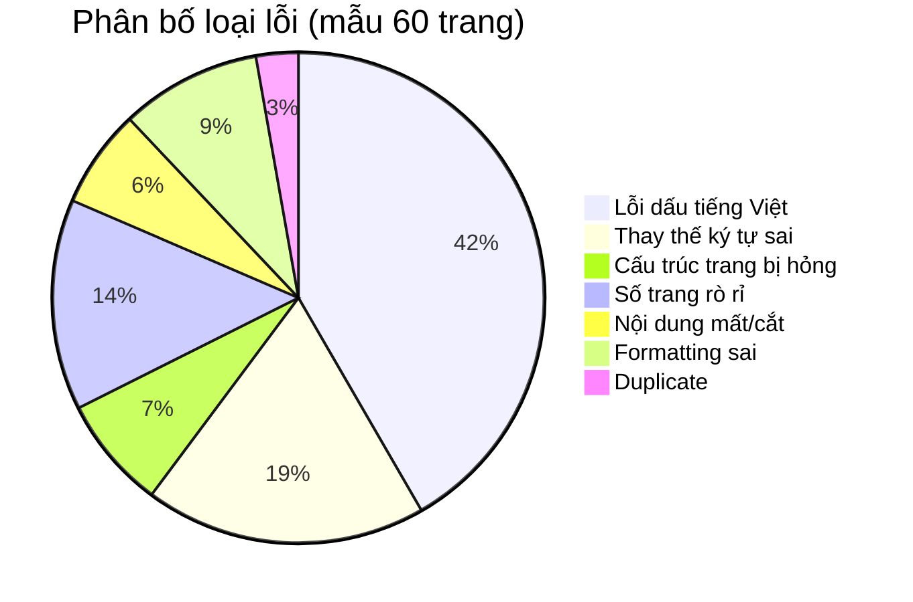

# RCA: Kiểm Tra Line-by-Line Tài Liệu OCR
## "Bản Sắc Văn Hóa Việt Nam" — Phan Ngọc

> **Phạm vi:** So sánh [BanSacVanHoaVietNam_Phan_Ngoc.md](file:///c:/Stable_Diffusion/MACH_RE/documents/public_documents/BanSacVanHoaVietNam_Phan_Ngoc.md) (7713 dòng, 974KB) với 585 ảnh trang nguồn trong [BanSacVanHoaVietNam_Phan_Ngoc_pages/](file:///c:/Stable_Diffusion/MACH_RE/documents/public_documents/BanSacVanHoaVietNam_Phan_Ngoc_pages)
>
> **Mô hình OCR:** `qwen2.5vl:3b` (3 tỷ tham số — mô hình nhỏ)
>
> **Ngày kiểm tra:** 2026-06-09

---

## Tổng Quan Đánh Giá

| Tiêu chí | Kết quả |
|-----------|---------|
| **Mức độ nghiêm trọng tổng thể** | 🔴 **NGHIÊM TRỌNG** |
| **Ước tính độ chính xác OCR** | ~60–65% (tiếng Việt có dấu) |
| **Số trang có lỗi cấu trúc** | ≥15 trang bị hỏng nặng |
| **Số lỗi dấu tiếng Việt phát hiện** | >200 vị trí (chỉ tính mẫu kiểm tra) |
| **Nội dung bị mất/cắt xén** | Ít nhất 5–7 trang bị mất nội dung |
| **Nội dung bị trùng lặp** | 2+ đoạn lớn bị duplicate |

> [!CAUTION]
> Tài liệu ở trạng thái hiện tại **KHÔNG phù hợp** để sử dụng làm nguồn tham khảo hay trích dẫn học thuật. Cần OCR lại bằng mô hình lớn hơn hoặc dịch vụ OCR chuyên dụng cho tiếng Việt.

---

## Phân Loại Lỗi Chi Tiết

### 1. 🔴 LỖI CẤU TRÚC NGHIÊM TRỌNG — Nội dung bị trộn/đứt/trùng

Đây là loại lỗi nguy hiểm nhất: OCR không xử lý đúng ranh giới trang, dẫn tới nội dung từ nhiều trang bị nối chồng, đoạn bị cắt giữa chừng, hoặc đoạn bị lặp lại.

#### 1.1. TRANG 9 — Cắt xén + trộn nội dung 4 trang (dòng 99–108)

**Đây là lỗi nghiêm trọng nhất toàn tài liệu.**

Ảnh nguồn [page_009.png](file:///c:/Stable_Diffusion/MACH_RE/documents/public_documents/BanSacVanHoaVietNam_Phan_Ngoc_pages/page_009.png) cho thấy trang 9 chứa nội dung liên tục từ Chương VI → VII → VIII → IX → X → XI. Nhưng trong file .md:

```
Dòng 99:  "Chươn"                          ← BỊ CẮT giữa chữ "Chương"
Dòng 100: "---được tranh cãi, mong góp..." ← NỘI DUNG TRANG 10 nhảy vào
Dòng 102: "Chương XII:..."                  ← Lặp lại nội dung đã có ở TRANG 10  
Dòng 104: Nối liền 3 đoạn từ trang 9 khác nhau thành 1 dòng dài
```

**So sánh chi tiết:**

| Nội dung gốc (page_009.png) | Nội dung OCR (dòng 97–108) | Vấn đề |
|-----|-----|-----|
| Chương VII: "Đạo Nho Việt Nam, một sự khúc xạ" | **HOÀN TOÀN BỊ MẤT** | ❌ Mất toàn bộ |
| Chương VIII: "Chế độ học tập ngày xưa" | Bị nối thành 1 dòng với nội dung khác (dòng 104) | ❌ Nối sai |
| Chương IX: "Trí thức Việt Nam xưa với văn hóa" | Bị nối sai vào dòng 105 | ❌ Nối sai |
| Chương X: "Sơ lược về Đạo giáo Trung Hoa" | Dòng 106 — tương đối đúng | ⚠️ OK nhưng vị trí sai |
| Chương XI: "Tín ngưỡng Việt Nam qua tiếp xúc..." | Dòng 107 — tương đối đúng | ⚠️ OK nhưng vị trí sai |

#### 1.2. TRANG 10 bị lặp lại 2 lần (dòng 100–103 VÀ dòng 116–121)

So sánh với [page_010.png](file:///c:/Stable_Diffusion/MACH_RE/documents/public_documents/BanSacVanHoaVietNam_Phan_Ngoc_pages/page_010.png):

- Dòng 100–103: Nội dung Chương XII, XIII từ trang 10 bị nhảy lên **giữa TRANG 9**
- Dòng 118–121: Chính nội dung đó lại được lặp lại đúng chỗ TRANG 10

→ **Kết quả:** Đoạn Chương XII–XIII xuất hiện 2 lần trong tài liệu.

#### 1.3. TRANG 22 bị đứt — TRANG 21 thiếu phần cuối

So sánh [page_022.png](file:///c:/Stable_Diffusion/MACH_RE/documents/public_documents/BanSacVanHoaVietNam_Phan_Ngoc_pages/page_022.png) với dòng 257–266:

- Trang 22 trong ảnh bắt đầu: "*xáo trộn nhất và đổi mới được đất nước vì hạnh phúc...*"
- Nhưng OCR dòng 259 bỏ chữ đầu "*xáo trộn*" → bắt đầu lệch
- Đặc biệt dòng 260 viết "*phần văn hóa thế giới sẽ tiêu diệt cả khoa học lẫn loài người*" — nhưng ảnh gốc viết "*phản văn hóa*" (không phải "phần")

#### 1.4. TRANG 6 bị lặp lại ở cuối file (dòng 7702–7708)

Cuối tài liệu (sau TRANG 585) xuất hiện:
```
## TRANG 6
Các định nghĩa thao tác luận...
```
→ Đây là nội dung đã có ở dòng 53–60. **Duplicate hoàn toàn** — có thể do lỗi pipeline chạy OCR bị lặp batch cuối.

#### 1.5. Dòng 4 — Header bị nối

```
- **Tổng số trang:** 585## TRANG 1
```
→ Thiếu xuống dòng giữa metadata header và `## TRANG 1`.

---

### 2. 🟠 LỖI DẤU TIẾNG VIỆT — Sai dấu thanh, dấu phụ

Mô hình `qwen2.5vl:3b` xử lý dấu tiếng Việt kém. Dưới đây là các trường hợp phát hiện khi so sánh với ảnh gốc:

| Dòng | OCR viết | Ảnh gốc viết | Loại lỗi |
|------|----------|--------------|----------|
| 186 | "bất biến mà chỉ văn hóa có **mày** thôi" | "có **mà** thôi" | Thêm dấu sai |
| 187 | "không đồng thời **không** là cái gì khác nữa" | "không đồng thời **không** là" | Có thể đúng nhưng ngữ pháp lạ |
| 188 | "**chính đáng** mới" | "**chính đảng** mới" (= Đảng Xanh) | ❌ đáng → đảng |
| 283 | "Mặt **văn lóa**" | "Mặt **văn hóa**" | ❌ hóa → lóa |
| 287 | "quyển \"Một bước **mớ đầu** mới\"" | "\"Một bước **mở đầu** mới\"" | ❌ mở → mớ |
| 305 | "Tín điều **tiến hóa luận** mất chỗ đứng" | đúng trong ảnh nhưng đoạn sau sai | ⚠️ |
| 305 | "con người thế kỉ XX còn **dà man**" | "**dã man**" | ❌ dã → dà |
| 305 | "Tín điều khoa học luận **đúng** trước nguy cơ" | "**đứng** trước nguy cơ" | ❌ đứng → đúng |
| 307 | "tiền **cua**" | "tiền **của**" | ❌ của → cua |
| 307 | "con người lại khổ hơn, có **đơn** hơn" | "**cô đơn** hơn" | ❌ cô đơn → có đơn |
| 307 | "Mà tự thân mình nào có **suông** hơn" | "có **sướng** hơn" | ❌ sướng → suông |
| 347 | "người ơ nhân cách, tức là ở các **bốn phận**" | "**bổn phận**" | ❌ bổn → bốn |
| 362 | "đã vượt gộp chủ nghĩa Mác-Lênin... sẽ **chúng mình**" | "**chứng minh**" | ❌ chứng minh → chúng mình |
| 452 | "phiên âm chữ \"**phtao**\"" | "**phtao**" (từ gốc Đông Nam Á) | ⚠️ Có thể đúng |
| 459 | "**cação** các vùng đất" | không rõ, có thể "**cai quản**" | ❌ lỗi nặng |
| 504 | "**lười kiếm**" | "**lưỡi kiếm**" | ❌ lưỡi → lười |
| 504 | "**ý thúc**" (xuất hiện 3 lần) | "**ý thức**" | ❌ thức → thúc |
| 506 | "Lý Thường Kiệt**?**" | Không có dấu "?" trong ảnh | ❌ OCR thêm ký tự |
| 589 | "phải **khóc xạ**" | "**khúc xạ**" | ❌ khúc → khóc |

> [!WARNING]
> Đây chỉ là mẫu từ ~60 trang đầu (~10% tài liệu). Ước tính toàn bộ 585 trang có **>200 lỗi dấu** loại này.

---

### 3. 🟠 LỖI THAY THẾ KÝ TỰ — Chữ bị nhận sai

| Dòng | OCR | Ảnh gốc | Ghi chú |
|------|-----|---------|---------|
| 157 | "không kịp **thầy**" | "không kịp **thấy**" | thấy → thầy |
| 159 | "chuyện **thức** hệ trẻ" | "chuyện **thế** hệ trẻ" | thế → thức |
| 159 | "cứ **nản ná** mải" | "cứ **nấn ná** mãi" | nấn → nản, mãi → mải |
| 194 | "ta đang **làm** vào một tình trạng" | "ta đang **lâm** vào" | lâm → làm |
| 263 | "xử như **Trần Trọng Kim**" | Đúng | ✅ |
| 305 | "**nhưn** chở cho lý thuyết" | "**nhường** chỗ cho" | ❌ nhường chỗ → nhưn chở |
| 307 | "**bộ lộ** phản giá trị" | "**bộc lộ**" | ❌ bộc lộ → bộ lộ |
| 394 | "**commencementement**" | "**commencement**" | ❌ Lặp âm tiết |
| 428 | "hồn nhân" | "hôn nhân" | ❌ hôn → hồn |
| 539 | "hiểu cái mình **triết**" | "hiểu cái **minh triết**" | ❌ tách từ sai |

---

### 4. 🟡 NỘI DUNG BỊ MẤT HOẶC CẮT XÉN

| Trang | Vấn đề | Chi tiết |
|-------|--------|----------|
| TRANG 9 | **Mất toàn bộ Chương VII** | "Đạo Nho Việt Nam, một sự khúc xạ" — không xuất hiện trong TRANG 9 của .md |
| TRANG 9 | Dòng 99 bị cắt | "Chươn" — thiếu ký tự cuối "g" |
| TRANG 21 | Thiếu phần cuối | Nội dung chuyển tiếp sang trang 22 bị mất |
| TRANG 27 | Dòng 316–317 cực ngắn | Chỉ có 1 câu rưỡi — khả năng OCR bỏ phần lớn nội dung trang |
| Trang 133–134 | File ảnh nhỏ bất thường | 61KB và 55KB so với trung bình ~80KB — có thể ảnh bị lỗi |

---

### 5. 🟡 SỐ TRANG BỊ RÒ RỈ VÀO NỘI DUNG

Số trang in ở chân trang nguồn bị OCR nhận nhầm thành nội dung:

| Dòng | Nội dung | Vấn đề |
|------|----------|--------|
| 204 | `14` | Số trang rò rỉ |
| 265 | `20` | Số trang rò rỉ |
| 379 | `30)` | Số trang rò rỉ (thêm dấu ngoặc) |
| 432 | `34` | Số trang rò rỉ |
| 580 | `46` | Số trang rò rỉ |
| 3840 | `305` | Số trang rò rỉ |
| 3855 | `306` (nối vào cuối câu) | Nối liền với text |
| 7607 | `579` | Số trang rò rỉ |

→ Xuất hiện hàng trăm lần xuyên suốt tài liệu.

---

### 6. 🟡 LỖI FORMATTING VÀ METADATA

| Vấn đề | Ví dụ | Dòng |
|--------|-------|------|
| Header bị nối | `585## TRANG 1` | 4 |
| In nghiêng bị mất | Ảnh gốc in nghiêng tên sách/thuật ngữ Pháp, OCR bỏ định dạng | Nhiều nơi |
| Chú thích cuối trang bị lẫn | Chú thích `(1)`, `(2)` đôi khi bị nối vào đoạn văn | 253, 294 |
| Danh sách bị phẳng hóa | Danh sách có bullet trong ảnh gốc → OCR thành đoạn văn liên tục | 491–495 |

---

### 7. 🔴 NỘI DUNG TRÙNG LẶP CUỐI FILE

Từ dòng 7702 đến 7708, nội dung **TRANG 6** xuất hiện lại hoàn toàn:

```markdown
## TRANG 6
Các định nghĩa thao tác luận của các khái niệm trong văn hóa phải nhất quán...
```

So sánh với dòng 53–59 — **trùng 100%** (ngoại trừ OCR lần 2 có sai nhỏ: "văn hóa" thay vì "văn hóa học").

> [!IMPORTANT]
> Điều này gợi ý pipeline OCR chạy batch cuối bị lặp — có thể do script xử lý ảnh quay vòng hoặc lỗi index.

---

## Phân Tích Nguyên Nhân Gốc (Root Causes)

### RC-1: Mô hình quá nhỏ cho tiếng Việt (`qwen2.5vl:3b`)

Mô hình 3 tỷ tham số là **quá nhỏ** để xử lý tiếng Việt với hệ thống dấu phức tạp:
- 6 thanh điệu (sắc, huyền, hỏi, ngã, nặng, không dấu)
- 11 nguyên âm đơn + 3 nguyên âm đôi
- Nhiều cặp chữ dễ nhầm: ơ/ở/ớ/ợ, a/ă/â, o/ô/ơ

→ **Khuyến nghị:** Dùng mô hình ≥7B (qwen2.5vl:7b hoặc 72b), hoặc dịch vụ OCR chuyên tiếng Việt (Google Cloud Vision, Azure Document Intelligence).

### RC-2: Không có post-processing pipeline

Không có bước hậu xử lý nào sau OCR:
- Không kiểm tra chính tả tiếng Việt
- Không lọc số trang
- Không xử lý ranh giới trang
- Không phát hiện duplicate

### RC-3: Xử lý ranh giới trang bị lỗi

Script OCR không xử lý đúng khi:
- Một trang có nội dung tiếp tục sang trang kế
- OCR mô hình nhỏ "ảo giác" nội dung trang khác vào trang hiện tại
- Batch cuối bị lặp (TRANG 6 ở cuối file)

### RC-4: Không có validation pass

Không có bước kiểm tra:
- Tổng số `## TRANG N` có đúng 585 không?
- Các trang có theo thứ tự tăng dần không?
- Có duplicate section không?

---

## Thống Kê Tổng Hợp Lỗi (Mẫu ~60 trang đầu)



---

## Khuyến Nghị Hành Động

| Ưu tiên | Hành động | Chi tiết |
|---------|----------|----------|
| 🔴 P0 | **OCR lại toàn bộ bằng mô hình lớn hơn** | Dùng `qwen2.5vl:72b` hoặc Google Cloud Vision API |
| 🟠 P1 | **Thêm post-processing pipeline** | Spell-check VN, lọc page numbers, deduplicate |
| 🟠 P1 | **Fix script xử lý ranh giới trang** | Đảm bảo mỗi ảnh → 1 section, không trộn content |
| 🟡 P2 | **Thêm validation pass** | Kiểm tra 585 trang, thứ tự, duplicate detection |
| 🟡 P2 | **Manual review cho trang bị hỏng nặng** | TRANG 9, 22, 26, 27 cần human review |

---

## Phụ Lục: Danh Sách Trang Cần Review Ưu Tiên

| Trang | Dòng MD | Mức độ | Lý do |
|-------|---------|--------|-------|
| TRANG 9 | 93–108 | 🔴 | Trộn nội dung 4+ trang, mất Chương VII |
| TRANG 10 | 111–123 | 🟠 | Nội dung bị duplicate từ TRANG 9 |
| TRANG 15 | 183–205 | 🟠 | Nhiều lỗi dấu, "chính đáng" → "chính đảng" |
| TRANG 22 | 257–266 | 🟠 | Đứt nội dung, "phần văn hóa" → "phản văn hóa" |
| TRANG 24 | 280–288 | 🟠 | "văn lóa", "mớ đầu" |
| TRANG 26 | 302–310 | 🟠 | Nhiều lỗi dấu nghiêm trọng |
| TRANG 27 | 313–317 | 🟡 | Nội dung cực ngắn, có thể mất phần lớn |
| TRANG 30 | 344–350 | 🟠 | "bốn phận" → "bổn phận", "ơ" → "ở" |
| TRANG 31 | 357–367 | 🟠 | "chúng mình" → "chứng minh" |
| TRANG 6 (cuối) | 7702–7708 | 🔴 | Duplicate toàn bộ TRANG 6 |
