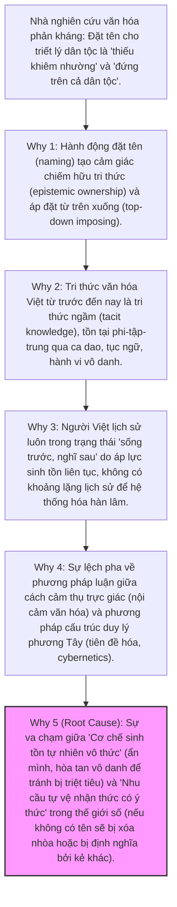

# Phân tích Chuyên sâu (RCA) & Đánh giá: Nghịch lý của sự "Khiêm nhường" và Hành động "Đặt tên" trong Framework Mạch Rễ

Báo cáo phân tích này tập trung vào bình luận của một nhà nghiên cứu văn hóa Việt Nam về Mạch Rễ: 
> *"Văn hóa VN thực ra nó đề cao sự khiêm nhường, kể cả có nghĩ ra cũng không ai muốn đứng lên trên cả dân tộc mà đặt tên."*

Bình luận này chạm đến một vấn đề triết học và nhân học cốt lõi: **Sự căng thẳng giữa "Phương thức Tồn tại vô danh" (Lived/Anonymous Experience) của văn hóa bản địa và "Nhu cầu Hệ thống hóa có ý thức" (Formal/Explicit Systematization) trong thời đại mới.**

---

## 1. Phân tích Nguyên nhân Gốc rễ (RCA) — 5 Tại sao (5 Whys)

Tại sao bình luận này lại xuất hiện và tại sao hành động "đặt tên" của Mạch Rễ lại tạo ra sự phản kháng về mặt cảm thức văn hóa?

*   **Why 1: Tại sao việc đặt tên lại bị coi là "đứng lên trên cả dân tộc"?**  
    Bởi vì trong ngôn ngữ học và chính trị tri thức, quyền đặt tên (naming power) thường đi liền với quyền sở hữu và định hình. Khi một nhóm tác giả tuyên bố "đặt tên và hệ thống hóa triết lý sinh tồn của dân tộc", nó tạo ra cảm giác một "chủ thể đứng ngoài" đang định nghĩa và áp đặt khuôn mẫu lên một thực thể sống động, đa dạng là dân tộc Việt Nam.
*   **Why 2: Tại sao người Việt lại nhạy cảm với việc chiếm hữu tri thức này?**  
    Vì cốt lõi của văn hóa Việt Nam mang tính cộng đồng và phi-bản-thể (Anattā/Vô ngã). Các di sản văn hóa lớn nhất (ca dao, truyền thuyết, phong tục) đều là **vô danh**. Bản sắc Việt không được giữ bởi các cá nhân kiệt xuất tự xưng, mà bởi mạng lưới quan hệ phân tán (làng xã, gia đình). Việc một cá nhân hay nhóm tự nhận danh nghĩa "đặt tên" đi ngược lại cơ chế vô ngã này.
*   **Why 3: Tại sao triết lý Việt chưa từng được hệ thống hóa có tên riêng như các dân tộc khác?**  
    Như tài liệu Mạch Rễ đã tự phân tích: áp lực sinh tồn liên tục buộc người Việt phải ưu tiên thực hành sinh tồn thực tế thay vì lý thuyết hóa. Trải qua hàng ngàn năm Bắc thuộc và chiến tranh liên miên, "sống sót" là mục tiêu tối thượng. Việc hệ thống hóa đòi hỏi một tầng lớp tinh hoa có đủ khoảng lùi lịch sử và sự ổn định thiết chế (như tầng lớp võ sĩ Samurai/nghệ nhân Nhật Bản tạo ra *Wabi-sabi*, hay học giả châu Phi thời bình lý thuyết hóa *Ubuntu*).
*   **Why 4: Tại sao Mạch Rễ lại chọn cách tiếp cận cấu trúc chặt chẽ gây cảm giác "phương Tây"?**  
    Vì để đối thoại sòng phẳng với triết học thế giới và để thiết lập một "hệ điều hành nhận thức" mạch lạc cho thế hệ số (Gen Z, Alpha), Mạch Rễ buộc phải dùng ngôn ngữ hệ thống (tiên đề, mệnh đề, kiểm chứng chéo, RCA). Sự duy lý này vô tình xung đột với thói quen tư duy trực giác, dung hòa, "mơ hồ có định hướng" của văn hóa truyền thống Việt.
*   **Why 5 (Root Cause - Nguyên nhân gốc rễ): Sự xung đột giữa phương thức tự vệ bằng cách "ẩn mình vô danh" và phương thức tự vệ bằng cách "định hình cấu trúc".**  
    Trong quá khứ, sự khiêm nhường, hòa tan và vô danh là một chiến lược sinh tồn (Tiên Đề IV - Biên giới mềm): ẩn mình dưới vỏ bọc của các hệ thống khác (như Việt hóa chữ Hán, mượn áo Phật giáo/Nho giáo) để tránh bị triệt tiêu. Nhưng trong thời đại toàn cầu hóa và đô thị hóa nhanh chóng, khi môi trường tự nhiên (làng xã) bị phá vỡ, nếu một triết lý không được ngôn ngữ hóa, nó sẽ bốc hơi. Mâu thuẫn nằm ở chỗ: **Để cứu một triết lý đề cao sự ẩn mình, ta lại phải phơi bày và đặt tên cho nó.**

---

## 2. Đánh giá và Nhận xét

### 2.1. Về bình luận của nhà nghiên cứu văn hóa
> [!IMPORTANT]
> **Đây là một phản biện có giá trị học thuật và độ nhạy cảm văn hóa cực cao.**
*   **Điểm đúng đắn:** Nhà nghiên cứu đã chỉ ra đúng **"điểm mù nhận thức"** (epistemic blindspot) của Mạch Rễ. Tuyên ngôn hiện tại của Mạch Rễ (đặc biệt là câu: *"Được sống: từ khi có dân tộc Việt. Được đặt tên: 2026."*) có phần thiếu khiêm tốn, dễ bị hiểu nhầm là một hành vi tự phụ nhận thức (epistemic hubris) — tự cho mình quyền năng đóng khung tri thức của cả một dân tộc qua 4.000 năm vào một hệ tiên đề do một nhóm người soạn thảo năm 2026.
*   **Điểm hạn chế:** Ý kiến này có xu hướng lãng mạn hóa quá khứ và bỏ qua **áp lực đứt gãy thực tế**. Nếu tiếp tục giữ thái độ "không đặt tên, chỉ sống", thì trong bối cảnh thế hệ trẻ Việt Nam đang bị ngập lụt bởi các hệ giá trị ngoại lai (chủ nghĩa cá nhân phương Tây, chủ nghĩa tiêu dùng số), họ sẽ không có một điểm neo nhận thức rõ ràng nào để bám vào. Không đặt tên hôm nay đồng nghĩa với việc chấp nhận để các dòng chảy văn hóa mạnh hơn ngoài kia định nghĩa và đồng hóa thế hệ mai sau.

### 2.2. Về phía framework Mạch Rễ
*   **Sự nhất quán nội tại:** Thực chất, Mạch Rễ đã cố gắng hóa giải nghịch lý này ở tầng sâu triết học bằng cách neo vào **nhận thức luận Phật giáo (Prameya/Pramāṇa)** và thuyết **Vô ngã (Anattā)**. 
    *   Mạch Rễ định nghĩa bản sắc là *duyên khởi* (Tiên Đề I - Quan hệ bản thể) và *trống rỗng* (Tiên Đề II - Bất biến cấu trúc là quy ước/Tục đế, không phải Bản thể tuyệt đối).
    *   Cơ chế đặt tên của Mạch Rễ được tuyên bố là vận hành theo cơ chế loại trừ (*apoha*): xác định khái niệm bằng cách loại trừ những gì nó không phải, thay vì tuyên bố một bản chất cốt lõi bất dịch.
*   **Điểm yếu trong cách biểu đạt:** Mặc dù tầng sâu triết học cố gắng thể hiện sự khiêm nhường nhận thức (epistemic humility), nhưng **tầng bề mặt (giao diện, cách tuyên ngôn)** lại tạo ra cảm giác ngược lại. Việc sử dụng các thuật ngữ đậm tính kỹ thuật, tuyên ngôn mang tính lịch sử hóa tuyệt đối ("Được đặt tên: 2026") vô tình tạo ra một khoảng cách lớn với cảm thức khiêm nhường truyền thống của người Việt.

---

## 3. Đề xuất & Góp ý cải tiến cho Mạch Rễ

Để hóa giải nghịch lý này và tiếp thu trọn vẹn bình luận sâu sắc của nhà nghiên cứu văn hóa, Mạch Rễ cần thực hiện một số điều chỉnh về cả ngôn ngữ biểu đạt lẫn cấu trúc lý thuyết:

### 3.1. Làm mềm và phi-cá-nhân-hóa tuyên ngôn thương hiệu
*   **Thay đổi tuyên ngôn Hero:**  
    *   *Hiện tại:* `"Được sống: từ khi có dân tộc Việt. Được đặt tên: 2026."` (Nghe quá quyết đoán, dễ tạo cảm giác chiếm đoạt lịch sử).
    *   *Đề xuất chỉnh sửa:* `"Được sống: từ khi có dân tộc Việt. Nỗ lực hệ thống hóa và tạm đặt tên: 2026."` hoặc *"Được sống: trong dòng chảy 4.000 năm của dân tộc. Được tạm mô hình hóa: 2026."*
*   **Làm rõ vai trò "Người dịch cấu trúc" thay vì "Người đặt tên":**  
    Mạch Rễ cần khẳng định rõ trong phần giới thiệu (`index.html` và `what.html`) rằng: nhóm phát triển không "sáng tác" hay "ban tặng" tên gọi cho dân tộc. Tên gọi "Mạch Rễ" chỉ là một **bản dịch cấu trúc** bằng ngôn ngữ hệ thống hiện đại để đối thoại với thế giới, tương tự như việc các nhà khoa học đặt tên cho một loài cây vốn đã được người dân bản địa sử dụng từ ngàn năm.

### 3.2. Đưa "Sự Khiêm Nhường" (Tính Phi-Trung-Tâm) thành thuộc tính vận hành
*   **Tích hợp vào Tiên Đề I (Quan hệ bản thể) và Mệnh Đề V (Phân tán bản thể):**  
    Cần bổ sung một ghi chú hoặc mệnh đề phụ làm rõ: **Sự khiêm nhường của người Việt không phải là sự thụ động, mà là một cơ chế vận hành của mạng lưới phân tán.** Khi một hệ thống không có "node trung tâm" tự xưng (vô ngã), hệ thống đó sẽ cực kỳ bền vững trước các cuộc tấn công trực diện. Sự khiêm nhường chính là tấm khiên bảo vệ trục phân tán (Mệnh Đề V).
*   **Sử dụng ẩn dụ "Chiếc bè" (Upāya - Phương tiện thiện xảo):**  
    Nhấn mạnh rằng Mạch Rễ là một *Upāya* (phương tiện) trong Phật giáo. Nó là chiếc bè để đưa thế hệ trẻ qua dòng sông đứt gãy nhận thức hiện tại. Khi đã qua sông (khi bản sắc đã tự vận hành vững chắc), chiếc bè có thể được bỏ lại. Việc đặt tên chỉ mang tính công cụ quy ước (*saṃvṛti-sat*), không phải là chân lý tối hậu (*paramārtha-sat*).

### 3.3. Bổ sung một Module/Ghi chú phản tư trong tài liệu chính thức
*   Cần đưa chính bình luận này của nhà nghiên cứu văn hóa vào như một trường hợp nghiên cứu (case study) trong phần **Tiên Đề VIII (Tự nhìn thấy mình - Reflexivity)** hoặc trong phần **RCA Tên gọi** ở `what.html`. 
*   Việc tự đưa phản biện của đối thủ/học giả vào tài liệu chính thức không làm yếu đi framework, ngược lại, nó chứng minh Tiên Đề VIII đang hoạt động hiệu quả: hệ thống có khả năng tự quan sát, tự phê bình và hấp thụ nhiễu loạn để nâng cấp độ phức tạp cấu trúc của chính mình.

---

> [!TIP]
> **Nhận xét kết luận:**  
> Ý kiến của nhà nghiên cứu văn hóa không phải là một đòn tấn công phủ định Mạch Rễ, mà là một **"nhiễu có định hướng"** vô cùng quý giá (theo Mệnh Đề VI). Nếu Mạch Rễ phản ứng bằng cách tự vệ, dựng tường đóng kín (vi phạm Tiên Đề IV), framework sẽ tự chứng minh mình thất bại. Nếu Mạch Rễ hấp thụ bình luận này, biến nó thành chất liệu để tự điều chỉnh ngôn từ khiêm cung hơn, làm rõ tính chất vô ngã và công cụ tạm thời của mình, Mạch Rễ sẽ thực sự trở nên sâu sắc và thuyết phục hơn đối với cộng đồng học thuật Việt Nam.
