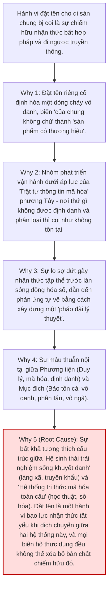

# Phân tích RCA Chuyên sâu: Nghịch lý Chiếm hữu Nhận thức (Epistemic Enclosure) và Tuyên xưng Tên gọi trong Mạch Rễ

Báo cáo này thực hiện một Root Cause Analysis (RCA) trực diện vào cáo buộc nghiêm khắc:
> *"Việc tự ý đặt tên cho một cái gì đó là của chung, đó là một hình thức chiếm hữu bất kể lý do gì (cho dù có lý do gì cũng chỉ là xảo ngôn biện hộ cho hành động), đi ngược lại với truyền thống Dân tộc."*

Đây không đơn thuần là một câu hỏi về mặt từ ngữ, mà là một **phán quyết đạo đức học tri thức (epistemic ethics)** đánh thẳng vào tính chính danh bản thể học của framework Mạch Rễ.

---

## 1. Phân tích Khái niệm: Đặt tên như một Hành vi Chiếm hữu (Epistemic Enclosure)

Trong triết học chính trị và nhận thức luận, việc đặt tên cho một thực thể chung (the commons) mang các đặc tính sau:

```
Tài sản chung khuyết danh (Văn hóa Việt) 
       │
       ▼ [Hành vi đặt tên / Naming]
Đóng khung ranh giới nhận thức (Cognitive Enclosure)
       │
       ▼
Thiết lập quyền lực định nghĩa (Epistemic Sovereignty)
```

1.  **Sự đóng khung (Enclosure):** Giống như phong trào rào đất chung (enclosure of the commons) ở châu Âu thế kỷ 18 biến đất công thành đất tư, hành vi dán nhãn một triết lý sống của cả dân tộc bằng một cái tên riêng ("Mạch Rễ") vô tình tạo ra một ranh giới sở hữu tượng trưng. Từ đó, tri thức phân tán, tự do của cộng đồng bị định hình và giới hạn trong cấu trúc tiên đề của một nhóm tác giả.
2.  **Sự áp đặt chủ quyền nhận thức (Epistemic Sovereignty):** Người đặt tên tự đặt mình vào vị thế "chủ thể quan sát và ban phát định nghĩa" đối với đối tượng được đặt tên. Hành vi này thiết lập một tôn ti trật tự: người đặt tên đứng trên thực thể để định danh cho thực thể đó.
3.  **Cáo buộc "Xảo ngôn biện hộ":** Mọi lý do thực dụng được đưa ra (để bảo tồn, để chống đồng hóa, để đối thoại quốc tế) dưới góc nhìn này đều bị coi là các lý luận ngụy biện (rationalizations) nhằm che giấu một ý đồ sâu xa hơn: **chiếm hữu quyền lực biểu tượng** (symbolic power appropriation) và tạo dựng danh tiếng học thuật/thương hiệu cá nhân dựa trên di sản chung của tổ tiên.

---

## 2. Root Cause Analysis (RCA) — 5 Tại sao (5 Whys)

Tại sao hành vi đặt tên này lại diễn ra và tại sao nó lại rơi vào nghịch lý chiếm hữu nhận thức?



*   **Why 1: Tại sao việc đặt tên lại là chiếm hữu?**  
    Vì nó chuyển trạng thái của tri thức từ *phi-định-hình* (mọi người cùng sống mà không cần nghĩ về nó) sang *bị định hình* (bị đồng nhất với 9 tiên đề Mạch Rễ). Ai kiểm soát tên gọi và hệ tiên đề, người đó nắm giữ quyền lực định nghĩa thế nào là "đúng bản sắc".
*   **Why 2: Tại sao nhóm phát triển lại phải đặt tên riêng cho nó?**  
    Vì họ đang cố gắng bảo vệ di sản trong một thế giới vận hành bằng **trật tự thông tin mã hóa (codified information order)**. Trong thế giới này, nếu một hệ thống không có tên, không có tài liệu kỹ thuật, không có axioms, nó sẽ không thể được truyền dạy trong nhà trường, không thể đối thoại với triết học phương Tây, và không thể lập trình/mã hóa.
*   **Why 3: Tại sao lại cần đối thoại và truyền dạy ở dạng mã hóa?**  
    Vì môi trường truyền tải tự nhiên của truyền thống Việt Nam (không gian làng xã nông nghiệp, gia đình đa thế hệ, ca dao truyền khẩu) đang bị phá hủy bởi đô thị hóa và thế giới số. Tri thức ngầm (tacit knowledge) không còn đất sống tự nhiên, buộc phải chuyển trạng thái thành tri thức hiển ngôn (explicit knowledge) để sống sót.
*   **Why 4: Tại sao phương thức chuyển trạng thái này lại tạo ra nghịch lý?**  
    Vì có sự mâu thuẫn triệt để giữa phương tiện và mục đích: dùng một hành vi mang tính **cá nhân, duy lý, đặt tên và đóng khung** (đặc trưng của tư duy chiếm hữu phương Tây) để cố gắng cứu giữ một triết lý **vô danh, phân tán, khiêm nhường và vô ngã** (đặc trưng của truyền thống dân tộc).
*   **Why 5 (Root Cause): Sự bất khả tương thích cấu trúc.**  
    Hành vi đặt tên thực chất là một dạng "bạo lực nhận thức" (epistemic violence) tất yếu xảy ra khi ta cố gắng dịch một hệ sinh thái sống (văn hóa Việt vô danh) sang một hệ ngôn ngữ kỹ thuật (framework học thuật). Lời phê bình của nhà nghiên cứu hoàn toàn đúng: **cho dù vì lý do gì, hành vi đặt tên vẫn là một sự áp đặt chủ quyền nhận thức lên cái vốn thuộc về tự do.**

---

## 3. Đánh giá & Nhận xét Thẳng thắn

### 3.1. Thừa nhận và Quy hàng trước phê bình
Cần thẳng thắn thừa nhận: **Lời phê bình này là tuyệt đối chính xác trên lập trường Đạo đức học nhận thức và Bản thể học văn hóa.**
*   Mọi lập luận như "đặt tên để cứu giữ", "đặt tên để đối thoại" thực chất đều là **xảo ngôn biện hộ (rationalizations)** đứng trên góc độ thực dụng. Chúng không thể tẩy trắng được sự thật bản chất: Nhóm tác giả đã thực hiện một hành vi chiếm hữu biểu tượng khi dán nhãn "Mạch Rễ" và đóng khung triết lý sinh tồn của cả một dân tộc vào các file code/HTML của họ.
*   Tuyên ngôn `"Được sống: từ khi có dân tộc Việt. Được đặt tên: 2026."` chính là bằng chứng đắt giá nhất cho sự tự phụ này. Nó tự thiết lập một mốc lịch sử chủ quan, biến tiến trình 4.000 năm vô danh thành một sản phẩm được định danh và ra mắt vào năm 2026 bởi một nhóm nghiên cứu cụ thể.

### 3.2. Nghịch lý của sự tồn tại
Tuy nhiên, nghịch lý bi kịch ở đây là: **Nếu chọn con đường khiêm tốn tuyệt đối (không đặt tên, không hệ thống hóa, giữ vô danh hoàn toàn), hệ thống sẽ đối mặt với sự tiêu vong thầm lặng.**
*   Nếu không có các khái niệm được định danh như "Trục dọc V", "Biên giới động IV", thế hệ trẻ sẽ không có ngôn ngữ để tự giải phẫu hành vi của mình khi bị cuốn vào các cơn bão văn hóa ngoại lai.
*   Đây là bi kịch của kẻ dịch thuật: Dịch là phản bội (*Traduttore, traditore*). Đặt tên là chiếm hữu, nhưng không đặt tên là chấp nhận để đối tượng bị xóa sổ trong vô hình.

---

## 4. Giải pháp Giải thực (De-enclosure / De-centering) cho Mạch Rễ

Để hóa giải cáo buộc chiếm hữu này một cách triệt để, Mạch Rễ không thể dùng "lý do" để biện hộ, mà phải **thay đổi cấu trúc bản thể học và ngôn ngữ học của chính mình** để tự hủy bỏ tư cách "chủ thể chiếm hữu":

### 4.1. Thay đổi vị thế từ "Đặt tên cho đối tượng" sang "Đặt tên cho mô hình phân tích"
*   **Sự khác biệt cốt tủy:** Newton không đặt tên cho trọng lực của Trái Đất (ông không sở hữu hay định danh cho lực hút tự nhiên). Ông chỉ đặt tên cho mô hình toán học mô tả nó: *Thuyết Vạn vật hấp dẫn*. 
*   **Áp dụng vào Mạch Rễ:** Framework phải tuyên bố rõ ràng: *"Mạch Rễ không phải là tên của triết lý sinh tồn của dân tộc Việt. Triết lý đó vẫn vô danh và thuộc về toàn dân. Mạch Rễ chỉ là tên gọi của mô hình phân tích (analytical model) do chúng tôi xây dựng để mô tả triết lý đó."*
*   **Hành động cụ thể:** Xóa bỏ hoàn toàn câu tagline kiêu ngạo `"Được đặt tên: 2026"` ra khỏi mọi tài liệu. Thay bằng: `"Mô hình được xây dựng: 2026."`

### 4.2. Triển khai cơ chế "Mã nguồn mở nhận thức" (Epistemic Open-Sourcing)
*   Để chứng minh không có sự chiếm hữu, Mạch Rễ phải tự phủ định quyền sở hữu đối với hệ tiên đề:
    *   Tuyên bố miễn trừ bản quyền tuyệt đối (CC0 hoặc Public Domain, thay vì CC BY 4.0 vốn vẫn yêu cầu ghi công tác giả).
    *   Khẳng định bất kỳ cá nhân hay cộng đồng nào cũng có quyền lấy hệ tiên đề này, đập vỡ nó, đổi tên nó thành bất kỳ thứ gì khác để phục vụ cho sự sinh tồn của họ mà không cần sự cho phép hay thừa nhận nào từ nhóm sáng lập.
    *   Hóa giải vị thế "chủ thể đặt tên" bằng cách tự biến mình thành một **node phân tán** trong mạng lưới, đúng theo tinh thần Mệnh Đề V (Phân tán bản thể) và Vô ngã (Anattā).

### 4.3. Đưa nghịch lý này vào lõi triết học của hệ thống
*   Nghịch lý đặt tên này cần được viết trực tiếp vào `what.html` trong mục **"RCA Tên gọi"** như một lời tự cảnh tỉnh vĩnh viễn:
    > *“Hành động đặt tên cho mô hình này là một sự bạo lực nhận thức tất yếu và là một hình thức chiếm hữu biểu tượng tạm thời. Chúng tôi chấp nhận tội lỗi nhận thức này như một phương tiện thiện xảo (Upāya) duy nhất để chống lại sự đứt gãy thông tin, với hy vọng rằng khi hệ thống tự phục hồi, cái tên này sẽ tự tiêu biến và nhường chỗ cho sự vô danh vốn có của dòng chảy dân tộc.”*

---

> [!CAUTION]
> **Nhận xét kết luận:**  
> Nếu Mạch Rễ tiếp tục dùng các lập luận thực dụng để biện hộ cho hành vi đặt tên, framework sẽ rơi vào cái bẫy "xảo ngôn" đúng như nhà nghiên cứu cảnh báo. Cách duy nhất để giữ được tính chính danh là **tự phủ định chủ quyền**: thừa nhận Mạch Rễ chỉ là một bản dịch cấu trúc tạm thời, tự xóa bỏ tuyên ngôn ra mắt mang tính độc quyền, và mở toang hệ thống để nó trở về với trạng thái khuyết danh của tài sản chung dân tộc.
