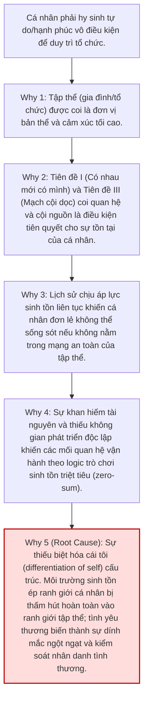
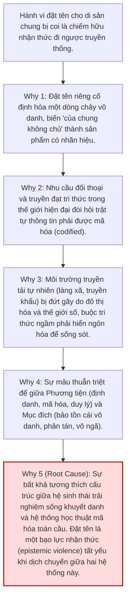

# Phân tích RCA Chuyên sâu: Các Mặt Tối và Giới hạn Cấu trúc của Framework Mạch Rễ

Báo cáo này thực hiện Root Cause Analysis (RCA) tích hợp đối với các mặt tối (shadow sides), giới hạn cấu trúc tự nhận, và nghịch lý đạo đức học nhận thức của framework Mạch Rễ.

---

## 1. Mặt tối 1: Sinh tồn triệt tiêu và Sự hy sinh tự hủy hoại của cá nhân (Zero-sum Relational Survival)

### 1.1 Triệu chứng & Bản chất
Trong các không gian sinh hoạt chật hẹp hoặc dưới áp lực sinh tồn lịch sử cực hạn, tình yêu thương và sự trung thành được thể hiện qua **sự dính mắc cảm xúc cực đoan (enmeshment)** và **sự hy sinh tự hủy hoại của cá nhân**. 
- Quyền lợi, tự do và sự phát triển của cá nhân bị triệt tiêu để bảo vệ tính bất biến cấu trúc (Axiom II) của tập thể (gia đình, dòng họ, tổ chức).
- Sự hy sinh này tạo ra một **"món nợ đạo đức" (moral/filial debt)** đè nặng lên vai những thành viên khác, tước đoạt khả năng biệt hóa cái tôi lành mạnh (differentiation of self) của họ.

### 1.2 Phân tích RCA 5 Whys (Tại sao cá nhân phải hy sinh vì tổ chức?)

---

## 2. Mặt tối 2: Nghịch lý Chiếm hữu Nhận thức (Epistemic Enclosure)

### 2.1 Triệu chứng & Bản chất
Việc đặt tên riêng ("Mạch Rễ"), gán axioms học thuật, và mã hóa tri thức dân gian khuyết danh của cả một dân tộc thành một framework cấu trúc vô tình tạo ra một **ranh giới sở hữu biểu tượng**. Nó biến một tài sản chung chảy trôi, vô ngã thành một sản phẩm có thương hiệu gắn với nhóm tác giả.

### 2.2 Phân tích RCA 5 Whys (Tại sao hành vi đặt tên lại là chiếm hữu?)

---

## 3. Tổng hợp 5 Giới hạn cấu trúc tự nhận (Structural Limitations)

| Giới hạn | Tiên đề liên quan | Biểu hiện cụ thể | Hậu quả/Mặt tối | Giải pháp trong Mạch Rễ Upgraded |
| :--- | :--- | :--- | :--- | :--- |
| **Giới hạn I: Known Network** | Tiên Đề I (Quan hệ bản thể) | Chỉ giải thích được sự gắn kết trong các mối quan hệ đã quen biết (gia đình, làng xã). | Không xây dựng được niềm tin công dân (civic trust) và nghĩa vụ với người lạ (strangers). | **Mở rộng bằng Karuṇā (Từ bi):** Nhận diện hệ tương thuộc vượt ranh giới quen biết. |
| **Giới hạn II: Static Invariance** | Tiên Đề II (Bất biến cấu trúc) | Tập trung vào tính bất biến của pattern quan hệ. | Dễ dẫn đến tư duy bảo thủ, trì trệ, ôm giữ quá khứ không phù hợp. | **Mở rộng bằng Pramāṇa (Tự phê bình):** Nghi ngờ và tự xét lại pattern cũ qua thời gian. |
| **Giới hạn III: Past-Facing Bias** | Tiên Đề III (Mạch cội dọc) | Chỉ thiết lập đối thoại dọc với tổ tiên ở chiều quá khứ. | Thiếu trách nhiệm với tương lai (thế hệ chưa sinh) và tư duy hàng hóa công cộng (public goods). | **Mở rộng bằng Bodhicitta (Bồ đề tâm):** Hướng trách nhiệm đến thế hệ tương lai. |
| **Giới hạn IV: Assumed Consensus** | Tiên Đề II (Bản sắc lõi) | Mặc định cộng đồng đồng thuận về lõi của mình. | Không xử lý được các cuộc tranh cãi nội bộ về căn tính (ví dụ: trong nước vs hải ngoại). | **Mở rộng bằng Xung Đột Lõi (Core Conflict):** Áp dụng Śūnyatā để giải trừ tự tính cố định của lõi. |
| **Giới hạn V: Anti-Centralization** | Mệnh Đề V (Phân tán bản thể) | Đề cao cấu trúc phân tán phi tập trung để giảm thiểu điểm gãy. | Chống lại mọi nỗ lực xây dựng thiết chế tập trung, kể cả thiết chế tốt và hiện đại. | **Mở rộng bằng Upāya (Phương tiện):** Chấp nhận thiết chế tập trung như phương tiện tạm thời. |

---

## 4. Đánh giá Đạo đức học Nhận thức & Khuyến nghị Hành động

> [!CAUTION]
> **Cảnh báo về sự tự phụ nhận thức:**  
> Nếu Mạch Rễ tiếp tục dùng các lập luận thực dụng để biện hộ cho các mặt tối và hành vi đặt tên của mình, framework sẽ rơi vào cái bẫy "xảo ngôn" (rationalization). Để duy trì tính chính danh bản thể học, framework phải tự áp dụng chính nguyên lý **Vô ngã (Anattā) / Tánh không (Śūnyatā)** lên bản thân nó:

1. **Từ bỏ tagging độc quyền:** Thay tagline `"Được đặt tên: 2026"` thành `"Mô hình phân tích được xây dựng: 2026"`. Khẳng định Mạch Rễ chỉ là một bản dịch cấu trúc tạm thời, không phải chủ quyền nhận thức đối với bản sắc dân tộc.
2. **Epistemic Open-Sourcing:** Áp dụng miễn trừ bản quyền tuyệt đối (CC0), cho phép cộng đồng tự do tháo rã, thay đổi hoặc vứt bỏ framework mà không cần ghi nhận hay xin phép nhóm sáng lập.
3. **Tích hợp Xung Đột Lõi vào Core:** Đưa module *Xung Đột Lõi (Core Conflict)* vào thẳng tài liệu chính như một cơ chế vận hành bắt buộc, thừa nhận rằng bất đồng về căn tính là biểu hiện của rễ đang thở, không phải rễ hỏng.
